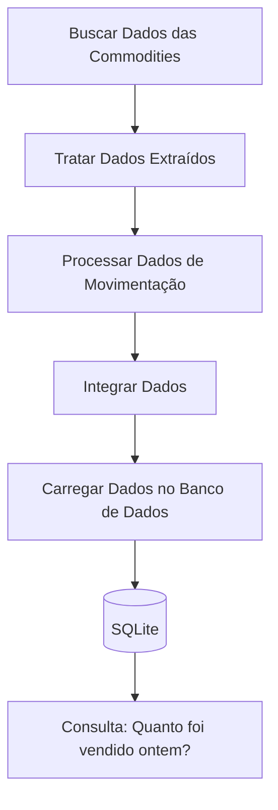

### README.md
==
# Projeto de ETL para Análise de Commodities

Este projeto implementa um pipeline ETL (Extração, Transformação e Carga) para analisar dados de commodities, como petróleo bruto, ouro e prata. Utilizamos a biblioteca `yfinance` para extrair dados históricos das commodities, processamos dados de movimentação e armazenamos os dados resultantes em um banco de dados SQLite.

## Estrutura do Projeto

```bash
├── data/
│   ├── dw/
│   │   └── commodities_dw.db
│   ├── external/
│   │   └── movimentacao_commodities.csv
├── extract.py
├── transforme.py
├── load.py
└── README.md
```

Para instalar as dependências, execute:

```bash
pip install pandas yfinance
```

## Descrição dos Arquivos

### `extract.py`

Extrai dados históricos das commodities utilizando a API do Yahoo Finance.

### `transforme.py`

Trata os dados extraídos, processa dados de movimentação e integra os dados.

### `load.py`

Carrega os dados integrados em um banco de dados SQLite.

## Executando o Projeto

1. **Extração de Dados**:
    - Execute `extract.py` para extrair dados históricos das commodities.

    ```bash
    python extract.py
    ```

2. **Transformação de Dados**:
    - Execute `transforme.py` para tratar, processar e integrar os dados.

    ```bash
    python transforme.py
    ```

3. **Carregamento de Dados**:
    - Execute `load.py` para carregar os dados integrados no banco de dados SQLite.

    ```bash
    python load.py
    ```

## Estrutura do Banco de Dados

Os dados integrados são armazenados em um banco de dados SQLite no arquivo `data/dw/commodities_dw.db`, na tabela `commodities`.

## Consultas Úteis

### Verificar transações em uma data específica

```sql
SELECT *
FROM commodities
WHERE data = '2023-06-07';
```

## Diagramas

Veja abaixo um diagrama do fluxo de dados do projeto.

### Diagrama Mermaid



### Observações

- Certifique-se de ter o arquivo `movimentacao_commodities.csv` no diretório `data/external/`.
- Certifique-se de ter permissões para criar diretórios e arquivos no diretório `data/`.
